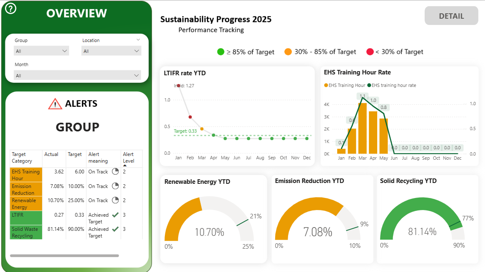
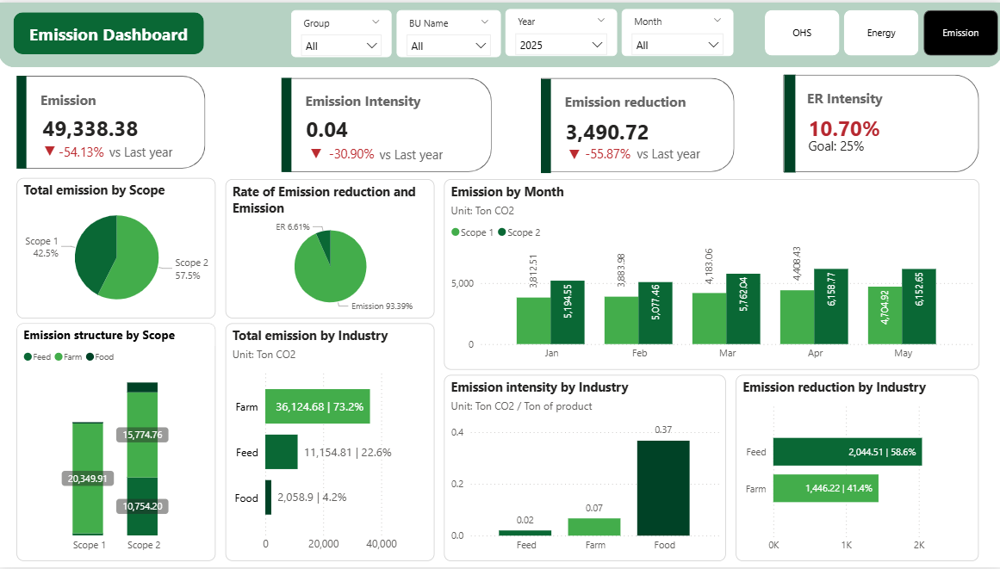
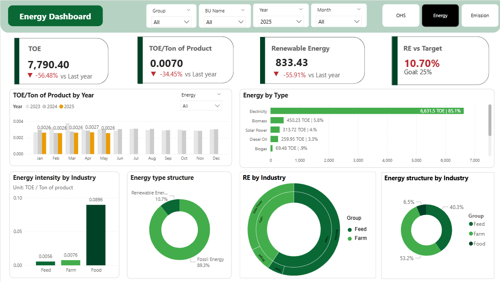
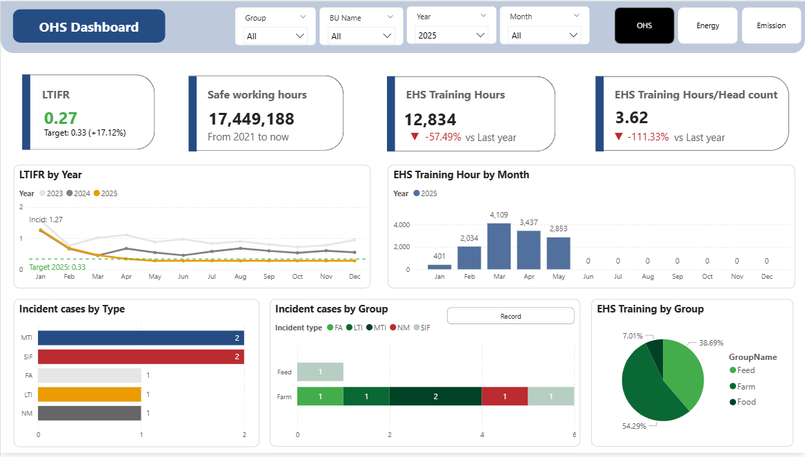

# EHS (Environment, Health, and Safety) Monthly Analytics Dashboard

## 📌 Project Overview
This project focuses on building an integrated system to manage, standardize, and visualize **EHS (Environment, Health, and Safety)** data for various Business Units (BUs) across multiple corporate Groups. Leveraging raw data sources covering energy consumption, environmental waste, workplace incidents, safety training hours, and safe working hours, the project cleanses the datasets, designs an optimized **Star Schema** data model, and constructs a comprehensive **Monthly Report (Power BI Dashboard)**. This system supports executive leadership in making strategic decisions regarding sustainability, regulatory compliance, and operational risk mitigation.

---

## 📊 Data Modeling
The data architecture is designed according to enterprise Data Warehouse standards using a **Star Schema** to optimize query performance and streamline DAX calculations within Power BI.

*Detailed entity relationships and mapping configurations can be referenced directly in the asset file:

### 1. Centralized Fact Tables
To prevent data inflation and replication errors (the Fan-out effect), the business logic separates core transactional metrics into dedicated Fact tables:
* **`fact_energy`**: Captures energy consumption data segmented by energy type (Biogas, Biomass, Coal, Diesel Oil, Electricity, Fuel Oil, LPG, Solar Power, etc.), emissions classification (Scope 1, Scope 2, ER - Emission Reduction), and handles calculations for Tonne of Oil Equivalent (TOE) and carbon footprint emissions.
* **`fact_environ`**: Manages environmental footprint indicators, including fecal sludge volume (`FecesAmount`), hazardous waste (`HazardousWaste`), solid waste (`SolidWasteAmount`, `Recycled Solid Waste Amount`), livestock herd dimensions (`HerdPigSize`), and biological emissions (`Pig Emission`).
* **`fact_incident`**: Records historical workplace safety anomalies and accidents, including classification types (LTI - Lost Time Injury, MTI - Medical Treatment Injury, FA - First Aid, NM - Near Miss), reporting status (Recordable/Non-recordable), and multi-level time horizons (Year, Quarter, Month, Day).
* **`fact_safety`**: Tracks proactive safety initiatives and metrics, such as employee safety suggestions (`EHSIdeas`), cumulative safety training hours (`EHSTrainingHour`), safe operating days per month (`SafeWorkingDay`), and total historical safe days (`SafeWorkingDayCum`).
* **`fact_safeworking`**: Contains operational exposure metrics like total working hours (`Working Hour`) and cumulative safe working hours (`Safe Working Hour Cum`), filtered and structured by worker categories (Regular Employees, Irregular Staff, and GF - Contractors/Visitors).

### 2. Dimension Tables
* **`dim_business_units`** *(Embedded structural hierarchy: PK, GroupID, BUID, BU)*: Serves as the master data reference for corporate structures and geographical areas (e.g., Long An, Vĩnh Long, Đồng Nai, Tây Ninh, Bắc Kạn, Yên Bái), supporting analytical drill-downs and Row-Level Security (RLS).
* **`dim_date`** *(Derived from historical fact dates)*: Provides a unified temporal framework across all schemas to enable consistent Time Intelligence reporting (YTD, QTD, MoM Growth).

---

## 📈 Power BI Dashboard Architecture (`Monthly Report.pbix`)
The interactive `Monthly Report.pbix` dashboard delivers a top-down executive view combined with granular drill-down analytical capabilities across three primary management pillars:

1.  **Workplace Safety Analytics**: Aggregates occupational injury cases across sub-categories (LTI, MTI, FA), calculates frequency and severity rates using denominator safe working hours, and spotlights business units achieving outstanding consecutive milestones in safe operating days (`SafeWorkingDayCum`).
2.  **Environmental & Waste Management**: Monitors tracking metrics for solid waste recycling efficiency, hazardous material generation, and biological greenhouse gas footprints stemming from agricultural operations.
3.  **Energy & Emission Dynamics**: Maps corporate energy portfolios, evaluates the adoption and growth rate of renewable options (Solar, Biogas, Biomass), and quantifies overall corporate emission reductions (ER) against sustainability targets.

---

## 🛠️ Technical Pipeline

1.  **Data Ingestion**: Extracted raw operational EHS data from distributed, flat CSV source files.
2.  **Data Transformation & Cleansing (ETL / Power Query)**:
    * Imputed missing values (Nulls/Blanks) in key numeric performance fields such as `EHSTrainingHour`.
    * Standardized datetime schemas into a consistent database format (`YYYY-MM-DD HH:MM:SS`).
    * Enforced UTF-8 character encoding across text fields to properly display Vietnamese textual localized assets (e.g., `BU` and region names).
3.  **Data Modeling**: Established relational star-schema mapping configurations (1-to-Many relationships) between dimensions and multiple business fact tables inside the Power BI engine.
4.  **Calculated Measures (DAX)**: Programmed custom advanced metrics to evaluate green energy transition metrics, recycling volume performance, and time-intelligent rolling safety aggregations.
5.  **Data Visualization UI/UX**: Crafted modern, user-centric report interfaces featuring coordinated global filtering sliders (Slicers) for streamlined navigation across Groups, BUs, and custom time periods.

## 💡 System Roadmap & Future Recommendations
* **Data Flow Automation**: Transition from historical manual file-based CSV uploads to fully automated Data Pipelines utilizing **Microsoft Fabric** or **Azure Data Factory** to ingest transactional logs straight into a central Lakehouse/Warehouse platform in near real-time.
* **Data Versioning & Audit Control**: Append rigorous system metadata (including execution timestamps and data steward signatures) to core source pipelines to maintain data pedigree, lineage tracing, and corporate audit readiness.
